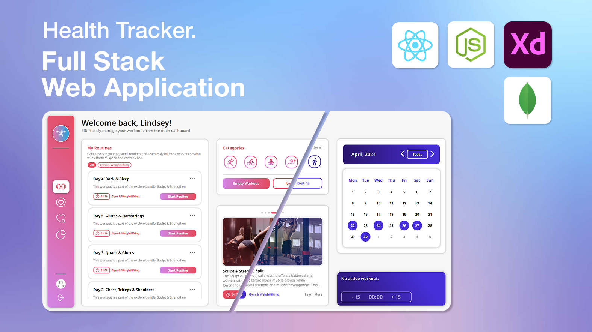

# 🏃‍♂️‍➡️ Health Tracker

### 👟 Project Introduction

Health Tracker is an all-in-one application designed to be your personal companion on the journey to a healthier and more active lifestyle. With this app, you can effortlessly track your workouts and monitor your progress, stay up-to-date on essential health metrics, access thousands of tailored workouts, and, most importantly, stay motivated throughout your journey.

What sets this app apart is its adaptive nature, tailoring itself to your individual needs and goals. The interface dynamically adjusts to reflect a personalized aesthetic, taking into account factors like gender for a more tailored experience. Moreover, the workout plans and recommendations provided are uniquely customized based on a variety of factors, ensuring that every suggestion is directly relevant to you.

### 📑 Table of Content

#### Account Management

The application includes fundamental account management functionalities, showcasing my skills in user authentication:

- [Registration & Login](documentation/pages/Account%20Management.md#🔑%20Registration%20&%20Login)
- [Email Verification & Account Actions](documentation/pages/Account%20Management.md#🔐%20Account%20Management)

#### Features & How To Use

The application is divided into four main sections, each addressing a distinct aspect of the user experience:

- [Workout Dashboard](documentation/pages/Workout%20Dashboard.md)
- [Health Essentials](documentation/pages/Health%20Essentials.md)
- [Explore](documentation/pages/Explore.md)
- [Statistics](documentation/pages/Statistics.md)

---

### 💻 Tech Stack & Process of Development

The provided app is a full-stack application, entirely crafted by me from the UI design to the backend REST API. Below is the comprehensive list of technologies I utilized throughout the project's development:

#### UI/UX Design

- Figma
- Adobe Illustrator

#### Frontend

- React
- TypeScript
- React DOM
- Redux
- CSS Modules

#### Backend

- Node.js
- TypeScript
- Express.js
- MongoDB
- Mongoose
- Multer
- BCryptJS
- JSONWebToken
- Nodemailer

---

### Contact Me

### 📬Email: ganchev.professional@gmail.com

### 📌LinkedIn: [www.linkedin.com/in/alex-ganchev](https://www.linkedin.com/in/alex-ganchev)

---
