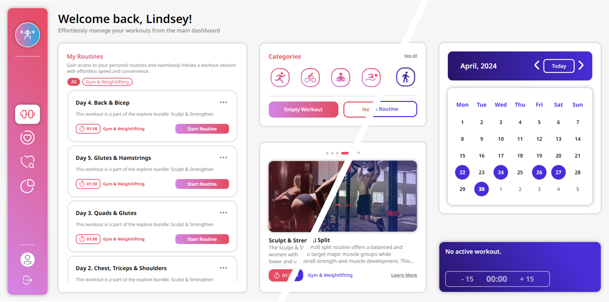

# 👟 AG Health Tracker

The primary goal of this web application is to showcase the skills I've independently acquired over the past two years. Through its development, I aim to demonstrate my proficiency in various technologies and methodologies. Your feedback is highly valued; please feel free to provide it through any of the contact links provided below.

### 💁🏻‍♂️ Project Introduction

AG Health Tracker is an all-in-one application designed to be your personal companion on the journey to a healthier and more active lifestyle. With this app, you can effortlessly track your workouts and monitor your progress, stay up-to-date on essential health metrics, access thousands of tailored workouts, and, most importantly, stay motivated throughout your journey.

What sets this app apart is its adaptive nature, tailoring itself to your individual needs and goals. The interface dynamically adjusts to reflect a personalized aesthetic, taking into account factors like gender for a more tailored experience. Moreover, the workout plans and recommendations provided are uniquely customized based on a variety of factors, ensuring that every suggestion is directly relevant to you.

---

### 📝 Read before you use the application: Some Notes & Disclaimers

#### Demo Accounts

For developers wishing to test the application without creating an account, **demo accounts are available**:

- email: male.demo@mail.com pass: mdemo123
- email: female.demo@mail.com pass: fdemo123

**Please note that account management for demo accounts is disabled for security reasons, ensuring availability for all developers testing the application.** To explore account management features, you'll need to create your own account with **a valid email address that you have access to**.

It's important to note that the accounts **don't have much data loaded due to the impracticality of manual input**. Therefore, you won't get a detailed overview of all features. However, you can test them out by adding entry data for today yourself within the application.

#### Registration Heads-Up

While the application implements security measures, **caution is advised during registration**. It's recommended **not to use important email addresses or real passwords**. However, you'll need to use an **accessible email for account management**, especially if you intend to delete your account after testing. For passwords, consider using something simple like "password" or "123456789".

#### Compatibility

For optimal performance, access the application via desktop Google Chrome. Some layout issues may occur in Safari or Firefox, but efforts are underway to address these.

While the application is fully responsive, minor layout bugs may be present in the mobile version, which are non-critical.

---

### 📑 Table of Content

#### Account Management

The application includes fundamental account management functionalities, showcasing my skills in user authentication:

- [Registration & Login](documentation/pages/Account%20Management#🔑%20Registration%20&%20Login)
- [Email Verification & Account Actions](documentation/pages/Account%20Management#🔐%20Account%20Management)

#### Features & How To Use

The application is divided into four main sections, each addressing a distinct aspect of the user experience:

- [Workout Dashboard](documentation/pages/Workout%20Dashboard.md)
- [Health Essentials](documentation/pages/Health%20Essentials.md)
- [Explore](documentation/pages/Explore.md)
- [Statistics](documentation/pages/Statistics.md)

---

### 💻 Tech Stack & Process of Development

The provided app is a full-stack application, entirely crafted by me from the UI design to the backend REST API. Below is the comprehensive list of technologies I utilized throughout the project's development:

#### UI/UX Design

- Figma
- Adobe Illustrator

#### Frontend

- React
- TypeScript
- React DOM
- Redux
- CSS Modules

#### Backend

- Node.js
- TypeScript
- Express.js
- MongoDB
- Mongoose
- Multer
- BCryptJS
- JSONWebToken
- Nodemailer

---

### 🎯 Areas for Improvement and Known Issues

Please note that my top priority for the application was to have it hosted before the end of April. As a solo developer, there may be occasional issues that arise, but they shouldn't significantly impact the overall user experience.

If you encounter a bug not listed below or have any feedback, please don't hesitate to reach out. Your input is invaluable as I continue to refine and improve the application.
!

#### Code Refactoring

To enhance the maintainability and efficiency of the application's front end, several areas require refactoring:

1. **CSS Module Organization**:
   - Currently, styling is duplicated across multiple components, leading to unnecessary repetition.
   - Consider consolidating common styles into shared CSS modules to improve code organization and reduce redundancy.
2. **Code and Function Extraction**: - Certain parts of the codebase could benefit from being extracted into separate functions for improved readability and modularity. - Identifying and isolating reusable logic can simplify components and make them more maintainable.
   While these issues may not directly impact the functionality of the project, optimizing file sizes and improving code organization can lead to a more streamlined and manageable codebase, facilitating future development efforts.

#### Browser Compatibility

- The application's compatibility with browsers such as Firefox or Safari is not fully optimized at present.
- Modifications are underway to ensure better compatibility with these browsers.

#### Mobile Optimization

- Recognizing the importance of mobile usage scenarios, efforts are focused on enhancing the mobile experience of the application.
- Improvements are being made to ensure seamless usability and performance on mobile devices, acknowledging the preference for mobile usage, particularly when users are on the go.

#### Responsiveness

While the application demonstrates responsiveness across various devices, testing has revealed some issues with specific devices. Efforts are underway to rectify these issues and ensure a consistent user experience across all platforms. If you are one of this cases your patience is appreciated as I work to address these concerns and deliver a seamless experience for all users.

#### Landing Page

Currently, the landing page may appear bland and lacking in vitality. Rest assured, efforts are underway to enhance its design and create a more engaging user experience.

#### Backend Hosting

While I've selected a specific hosting service plan for the backend, please be aware that certain issues may arise beyond my control:

- **Profile Picture**: If you don't frequently use the application, the hosting service may automatically delete your profile picture due to inactivity.
- **Slow Loading**: During times of high traffic, you may experience slightly longer loading times. However, these occurrences are rare and should not significantly impact your experience.

---

### Contact Me

### 📬Email: ganchev.professional@gmail.com

### 📌LinkedIn: [www.linkedin.com/in/alex-ganchev](https://www.linkedin.com/in/alex-ganchev)

---
