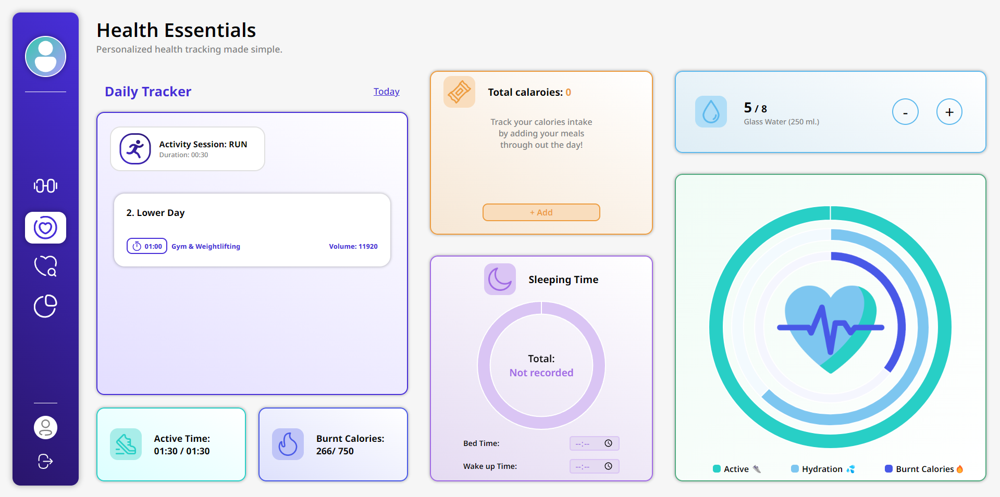
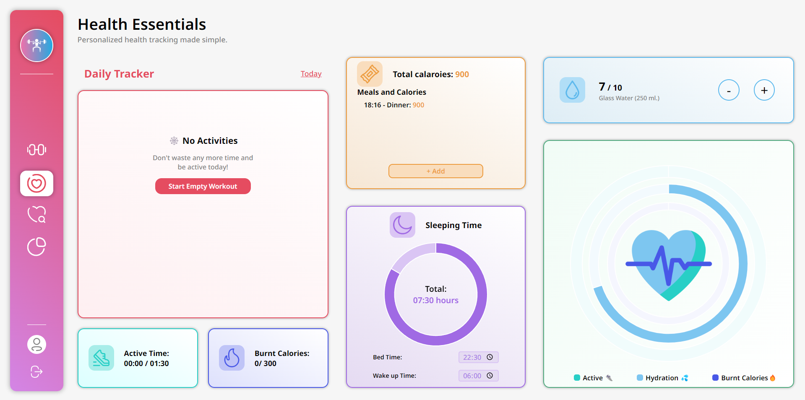

### 💁🏻‍♂️ Health Essentials: Introduction

The Health Essentials page enables you to track everything necessary for leading a healthier, active lifestyle. Here, you'll find various widgets, each responsible for managing a specific aspect:

- 👟 Total Workout Time
- 🔥 Total Calories Burned
- 🍏 Total Calories Intake
- 🌙 Total Sleep Time
- 💦 Total Water Intake

It's worth noting that each aspect's targets are automatically calculated based on the user's profile. This eliminates the need for users to worry about determining the right amounts for each activity, allowing them to focus on their actions. This streamlined tracking process makes staying healthy more manageable and enjoyable.

Additionally, if you miss tracking something, you have the option to modify records from the previous day. However, there's a short time limit on this option intentionally, encouraging users to be consistent in their measurements to avoid missing records.

The provided UI will indicate whether you've reached your targets, but the most significant indicator is the summary widget. This widget will be filled completely if you've successfully achieved your goals for the day.

---

---

---
