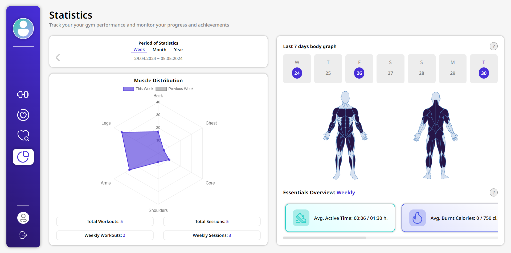
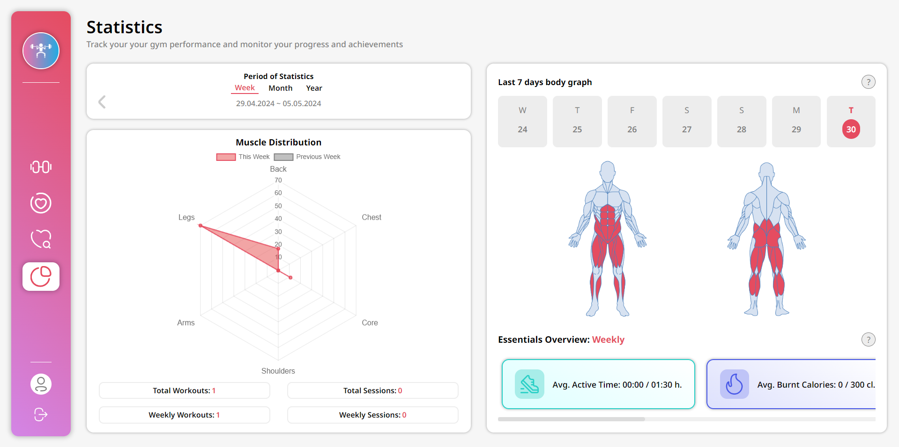
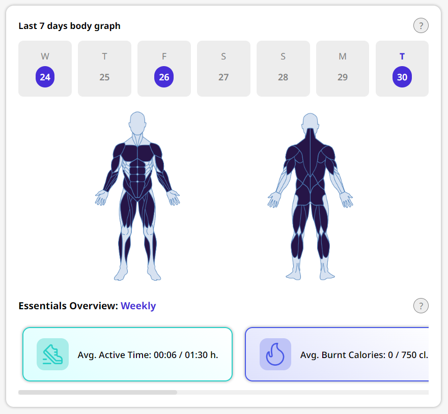
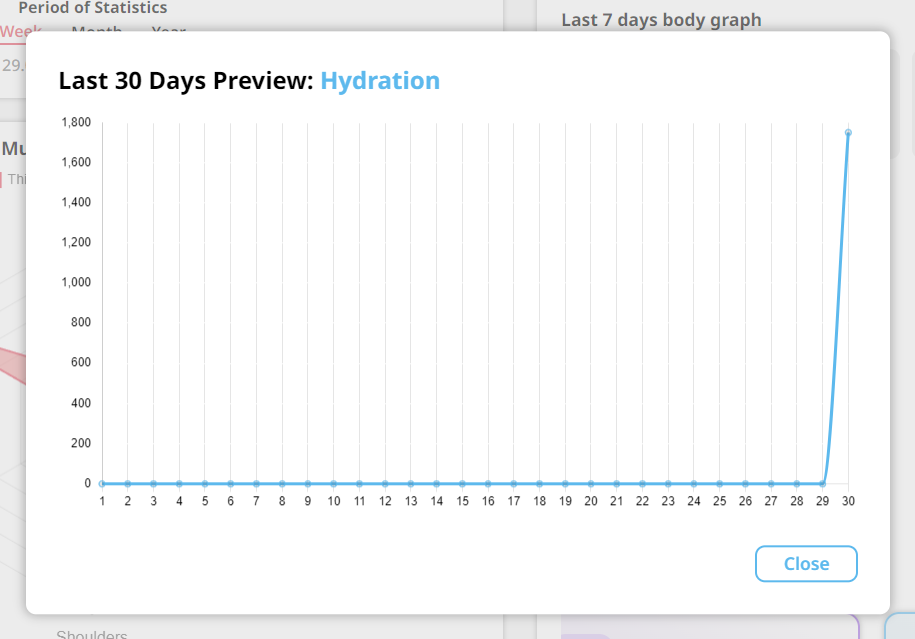

### 💁🏻‍♂️ Statistics: Introduction

The statistics view offers a summary of your performance, encompassing both activity development and overall health indicators. This is achieved through multiple graphs and visual presentations of your statistics, offering a comprehensive overview of your performance and health trends.

---

---

---

### 🕹️ Control Point

To control the duration period for viewing statistics, use the control bar at the top of the page. This allows you to change the displayed data across different widgets based on your preferred time frame.

### 🕷️ Spider Graph

The spider graph provides a comparison of how much you are targeting each muscle group throughout your workouts. This allows you to identify trends in your training behavior and determine if you have adequately trained all relevant muscle groups according to your needs.

---

![[Spider Graph]](../resources/spider_graph.png)

---

### 💪🏻 Body Display

The body graph displays the muscles you have worked out in the last 7 days, highlighting those that have been trained during this period. It's essential to ensure you have targeted all muscle groups within this timeframe. This allows you to track your progress and identify any potential gaps in your training regimen.

---

---

### 💗 Health Essentials Overview

Based on the chosen timespan from the control point, you will be presented with the average of each health essentials aspect for that period compared to the target. This provides a summarized view of how healthily you are leading your life.

By clicking on each essential you will be presented to a detailed graph of your performance through out the past 30 days.

---

---
