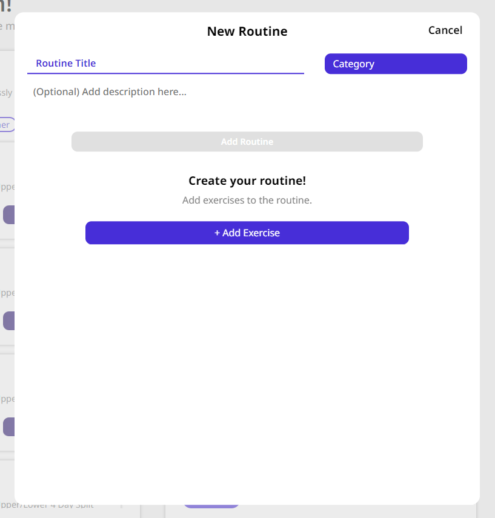

### 💁🏻‍♂️ Workout Dashboard: Introduction

The workout dashboard serves as your central hub for accessing, tracking, and managing your workouts. With a range of features tailored for seamless tracking, you can effortlessly monitor your activity sessions. Here are the key features available on this page:

- [Workout Dashboard](Workout%20Dashboard#👟%20Categories)
- [Routines](Workout%20Dashboard#🔁%20Routines)
- [Explore Widget](Workout%20Dashboard#🧭%20Explore%20Widget)
- [Calendar Tracker](Workout%20Dashboard#🗓️%20Calendar%20Widget)
- [Workout Pad](Workout%20Dashboard#🥏%20Workout%20Pad)

---

---

---

### 👟 Categories

The **Categories widget** allows you to quickly start and manage the activity you are about to track. It can be found at the top middle part of the dashboard.

---

---

At the top of the **Categories widget**, you'll find buttons labeled with specific activities. These are the **activity session buttons**. By selecting one, you can track the **duration and calories burned during that activity**. Activating an activity session button enables the **Activity Session Tracker**, providing real-time monitoring of your activity.

Below the activity session buttons, you'll encounter two additional buttons:

- **Empty Workout**: This button initiates the **Workout Tracker** in a fully blank state. Here, you can add the exercises you plan to perform during your training session.
- **New Routine**: This button enables you to create a new routine, which you can then add to your collection for future use.

A **routine** serves as a **'template'** for your workout regimen. If you often repeat the same workout, creating a routine streamlines the process. With a routine, you can begin your workout without manually inputting exercises, sets, and rest times each time. Additionally, you can add notes to exercises as reminders, ensuring they're readily available whenever you initiate your workout from the designated routine.

---

---

### 🔁 Routines

The **Routine widget** provides access to all your previously saved or created routines. You can organize them into categories and easily search through them. Additionally, you can edit a routine to **make modifications** or **delete** it entirely from your collection. If you click on the card rather than the start button you will be presented with a **preview of the routine.**

---

---

### 🧭 Explore Widget

The Explore widget offers a condensed version of the 'Just For You' carousel found on the Explore Page. It presents articles and workouts tailored to your preferences. Clicking 'Learn More' opens the article in a new page for further exploration.

---

---

### 🗓️ Calendar Widget

The Calendar widget provides a visual overview of your workout and activity history. Furthermore, by clicking on a date with recorded activity allows you to preview all the activities performed on that day.

---

---

### 🥏 Workout Pad

The **Workout Pad** is activated when you start an activity or a workout. While in workout mode, you can minimize or expand the **Workout Tracker**, allowing you to navigate throughout the application even while being active. It also displays details about your current workout.

---

---
